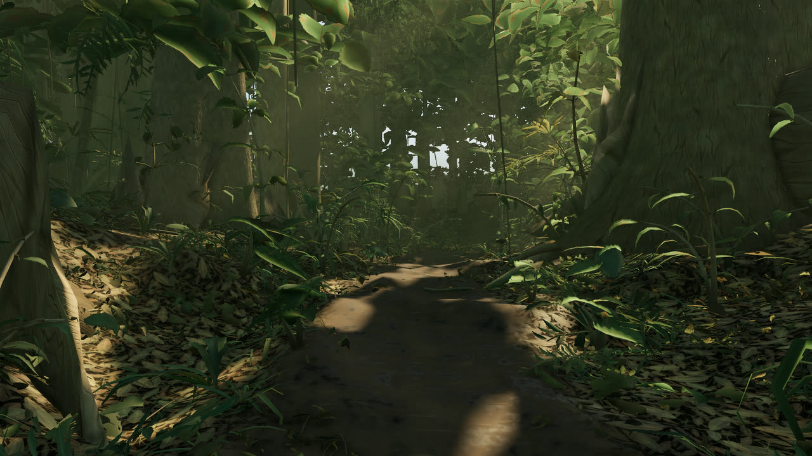
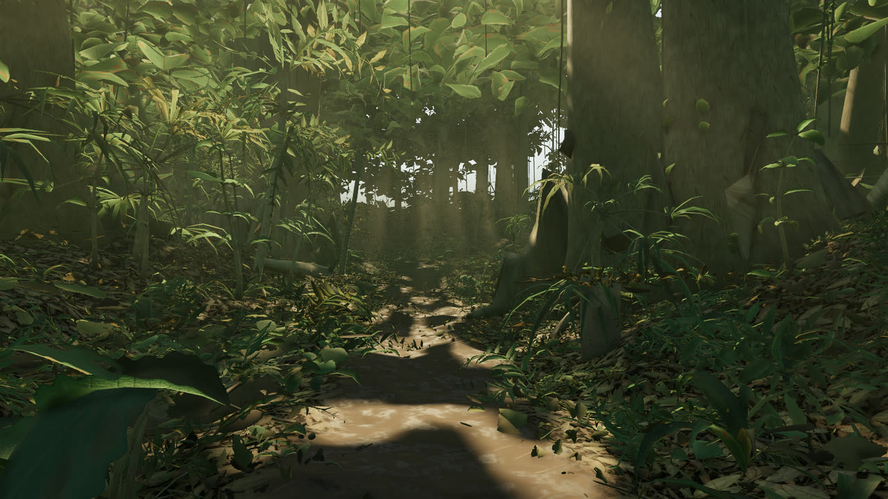
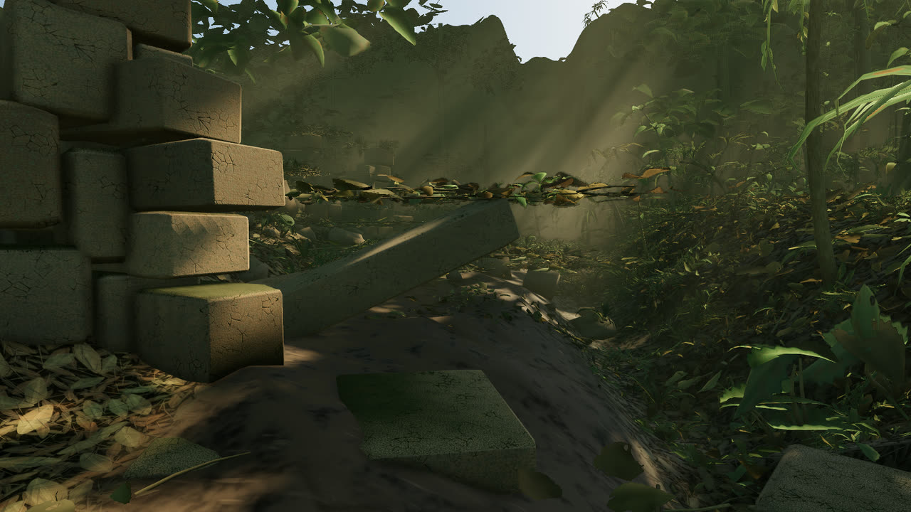
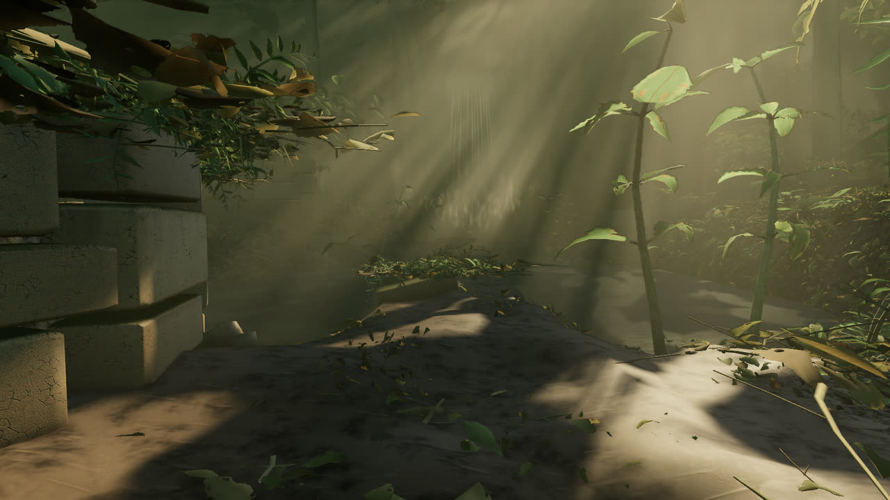
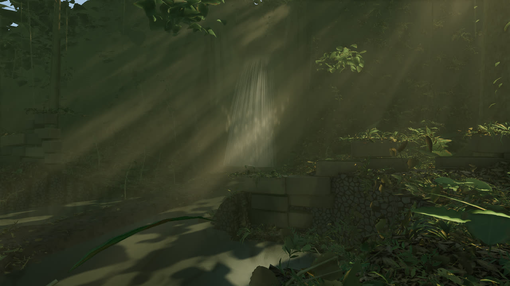

# Jungle Trail

A first-person walk down a winding jungle trail into overgrown stone ruins with a
waterfall, built in Three.js with zero external art assets. Every texture, mesh
and sound in the scene is generated procedurally in code. There are no image
files, no models, no audio recordings and no material libraries: the leaf atlas,
the bark, the ground, the stone, the character's skin and all sixty audio buffers
are computed at load time.

Live: **https://starknightt.github.io/jungle-trail/**



## Running it locally

There is no build step. The page is plain ES modules with an importmap, so it
only needs a static file server.

```
git clone https://github.com/StarKnightt/jungle-trail.git
cd jungle-trail
npm run serve
```

Then open `http://localhost:8099/`. Any other static server works equally well;
opening `index.html` from the filesystem does not, because ES modules and workers
need a real origin.

`npm install` is only needed for the capture tools in `tools/`, which use
Playwright. The game itself does not need it.

## Controls

| Input | Action |
|---|---|
| Click | Lock the pointer |
| Mouse | Look |
| W A S D | Move |
| Shift | Sprint |
| Space | Jump |
| 1 - 5 | Teleport along the trail |

The teleport keys are 1 trailhead, 2 mid trail, 3 ruins approach, 4 temple
clearing, 5 the falls.



## What is in it

- ~12,000 lines of hand-written code across 51 files.
- A 423.8 m trail across a 180 x 492 m world, from a 361 x 985 heightfield
  sampled every 0.5 m.
- 100,799 individual plants across 16 species, all built from two primitives: a
  bent leaf card and a swept tube.
- 536 individually eroded stone blocks. The ruin plan is computed before the
  terrain, so the ground builds a terrace and spoil banks beneath the temple
  rather than the temple being dropped onto whatever the ground happened to do.
- A procedural character: 22 bones, 7,488 triangles, and a 512-square procedural
  body atlas.
- 15 GPU texture bakes producing 29 images. The leaf atlas is 2048-square; the
  bark and ground sets are 1024-square.
- 17 distinct synthesized voices and 60 audio buffers, baked in a worker on the
  first user gesture.



## Performance

6.3 - 6.8 ms per frame on an RTX 4060 at 1600x900 — 147 fps in the corridor at
495 scene draw calls, 157 fps facing the falls at 234. The game caps itself at
60 fps; there is no reason for a walking-pace scene to render at 300.

The pool's planar reflection is the one pass that is not free: it is a second
submission of the whole clearing and it costs about 1.4 ms of a falls-facing
frame. It is skipped entirely whenever the pool is off screen, which is most of
the walk, it runs at 36 per cent resolution, it reuses the shadow map the main
pass is about to use, and it refreshes on alternate frames. Off below the `high`
tier, where the water falls back to a graded analytic reflection.

## Techniques

**GPU texture baking.** Every texture is a GLSL `surf()` function rendered into a
render target. Normal maps are derived by Sobel-sampling the same function rather
than being authored separately, so the normal can never disagree with the albedo
it belongs to.

**Noise.** Perlin FBM and ridged Perlin, Ashima simplex in 2D and 3D, periodic
domain-wrapped Perlin taking a `vec2` period so a texture can tile at a different
rate on each axis, and Worley cellular noise.

**Sky and lighting.** Atmospheric scattering is baked to a cube and
PMREM-prefiltered, which means the sky you look at and the image-based lighting on
every surface are literally the same function evaluated twice, instead of a
skybox plus a separately tuned ambient term that drifts away from it.

**Canopy shadowing.** The canopy is not in the shadow map. It is replaced by an
analytic transmittance term, which is both cheaper and better behaved than trying
to resolve a hundred thousand leaf cards in a depth buffer.

**Volumetrics.** A half-resolution dithered raymarch for the light shafts.

**Audio.** The DSP is pure functions: `Float32Array` in, `Float32Array` out, with
no Web Audio anywhere in the synthesis path. Only `src/audio/engine.js` touches
the Web Audio API. That separation is what lets the exact same code render the
soundscape to WAV files offline in Node, which is how it gets measured.

The ambient beds loop at 9.31, 10.69, 11.73, 12.07, 13.37, 13.93, 14.91 and 16.41
seconds. Those lengths are mutually incommensurate, so the soundscape has no
common period and never audibly repeats.



## Status

Honest version: this is not finished.

- **In:** terrain, vegetation, lighting, ruins, character, audio and water.
- **Closed at 6/10 after four critic passes:** water. A blind critic scored it
  3, then 4, then 5, then 6 out of 10 and closed it there. It ruled the falling
  curtain itself closed after the third pass — the remaining gap there is satin
  instead of droplets, which is a limit of representing a fall as a swept quad
  sheet rather than something shader tuning can reach. Work after that ruling
  went to everything around the curtain: the churn dome, the plunge basin's foam
  rafts, a feeding stream above the lip, a visible brook, a planar reflection in
  the pool, readable waterline bands on the masonry, and the tongue at the lip.
  The impact zone, the worst offender for three passes, is now the best part of
  the system. What the critic left on the table for a future pass: the brook's
  banks are still straight, the reflection is soft, the masonry bands do not
  quite line up between blocks, and the lip crest wants notching.
- **Not done:** post-processing. No colour grading, no depth of field.

The vegetation and lighting critics signed off at 5/10 and 6/10 respectively, and
they signed off on diminishing returns rather than on perfection.



## A note on dependencies

`package.json` has zero runtime npm dependencies, but this is not a page that
loads nothing over the network: Three.js r170 is fetched from a jsDelivr CDN at
runtime through an importmap in `index.html`. Three.js and nothing else.

The zero-asset claim is a separate one, and it is airtight. There is no
`TextureLoader`, `GLTFLoader`, `RGBELoader`, `AudioLoader`, `fetch`,
`XMLHttpRequest`, `new Image` or `createImageBitmap` anywhere in `src/`.

## How it was built

The original brief this was built from is kept unedited in [PROMPT.md](PROMPT.md).

Each system was built and then reviewed by a separate critic that saw only
rendered screenshots and never the source. The critic scored photorealism against
real jungle photography, and the system was iterated until it passed.

Reviewing renders rather than code caught real bugs that reading the source would
not have:

- Tree trunks rendering black, from inverted quad winding.
- Dark outlines around every leaf, from a premultiplied-alpha bug in the texture
  baker.
- Volumetric light shafts standing vertically at sunset, because canopy distance
  was being measured straight up instead of along the sun ray.

## Licence

MIT. See [LICENSE](LICENSE).
